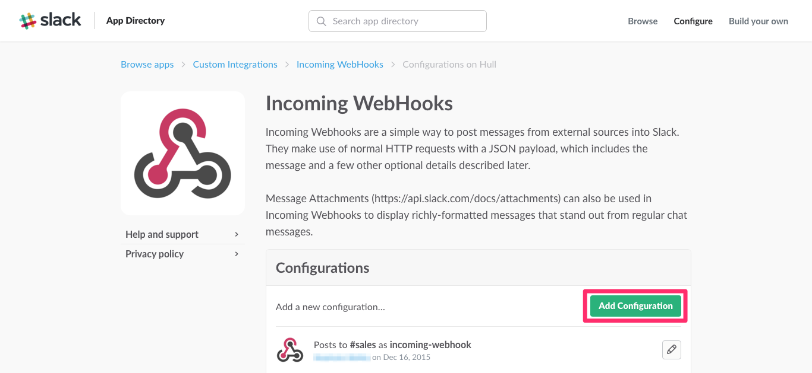
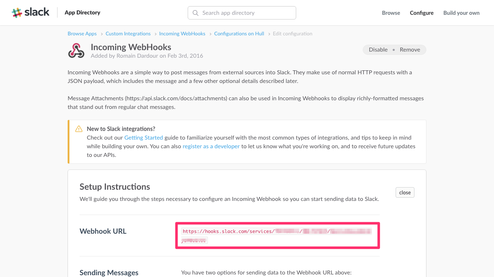

# Hull + Slack

This Ship notifies you on Slack when a Customer signs up, updates, enters or leaves a segment, and sends Daily, Weekly and Montly Organization reports to your Slack Channel

####  To install:

Create a Slack Incoming webhook [from your integrations page](https://my.slack.com/services/new/incoming-webhook/)

Copy the Webhook URL

Paste the Webhook URL in the Customize screen for your Slack Ship in the [Hull Dashboard](https://dashboard.hullapp.io)

_You can also change the Avatar Name and Picture, and change the Channel where messages are sent._

That's It! All user Creations, Updates, Deletions, Segment enters and leave are going to be sent to your Slack Channel!